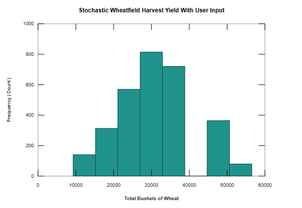

# Stochastic Wheatfield Harvest Yield Simulation

## Project Description
This project is a stochastic simulation built in MATLAB that models the harvest yield of a wheat field over a 10-month growing season. The model incorporates real-world variables, including user-defined growth rates and random weather conditions, to predict the final harvest yield and provide a statistical report of the outcomes.

## Business Question
How does the chance of sunny weather impact the total harvest yield of a wheat field, and what is the expected variability in the final harvest?

## Methodology
The simulation uses a **stochastic modeling approach** to simulate a series of independent experiments. The program's core logic is as follows:
- **User Input:** The model requires a user to define the number of experiments, the monthly chance of sun, and the growth rates for both sunny and cloudy conditions.
- **Inner Loop:** For each experiment, the program simulates 10 months. In each monthly step, a random number generator determines if the weather is sunny or cloudy, which in turn influences the wheat population's growth rate.
- **Population Dynamics:** The wheat population is modeled based on a simple growth equation, with a fixed amount lost each month to a hypothetical pest, *Puccinia*.
- **Outer Loop:** The entire simulation is run multiple times (defined by the user) to generate a distribution of possible outcomes.

## Key Findings & Results
The simulation of the wheatfield harvest yielded a clear understanding of how random environmental factors impact agricultural output. The primary finding is that a field's harvest is not a single, predictable number, but rather a **distribution of possible outcomes**.

The statistical report from **3,000 simulation runs** provides a clear summary of the results:

| Statistic | Value |
| :--- | :--- |
| **Mean** | 30382 |
| **Median** | 28838.8 |
| **Mode** | 56531.7 |
| **Maximum** | 56531.7 |
| **Minimum** | 9294.86 |
| **Standard Deviation** | 9544.17 |
| **Variance** | 9.10911e+07 |

The results show significant variability in the final harvest yield. The mean harvest was 30,382 bushels, but the final yield could range significantly from a high of 56,531 bushels (in a very sunny scenario) to a low of 9,294 bushels (in a very cloudy scenario).

This variability is visually represented in the histogram below, which shows the frequency of different harvest yields and confirms that the outcomes are not uniform.

## Conclusion

This project successfully demonstrates the use of a **stochastic simulation** to model a complex system. By running a large number of experiments, the model provided a realistic range of potential outcomes for the wheatfield harvest, which would not have been possible with a simple deterministic model. The findings underscore that in systems influenced by random variables, it is more valuable to predict the **range and probability of outcomes** than a single, fixed number. This approach can be applied to other fields, such as financial modeling or population dynamics, where uncertainty plays a key role.

## How to Run
This program can be run in MATLAB or Octave.

1.  **Open the file:** Open the `wheatfield3.m` file in MATLAB or Octave.
2.  **Run the script:** Run the script from the command line. You will be prompted to enter the following values:
    - **`number_of_expts`**: The number of simulation runs you want to perform.
    - **`chance_of_sun`**: A value between 0 and 1 representing the monthly probability of sunny weather.
    - **`birth_sunny`**: The growth rate of the wheatfield on a sunny month.
    - **`birth_cloudy`**: The growth rate of the wheatfield on a cloudy month.
    - **`lost_to_Puccinia`**: The number of bushels lost per month.

The program will then execute the simulation and display a statistical report and a histogram
